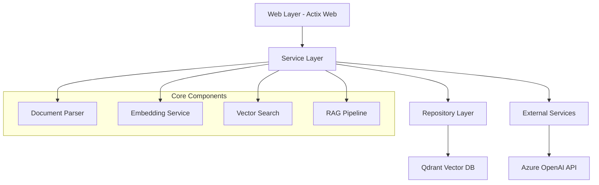
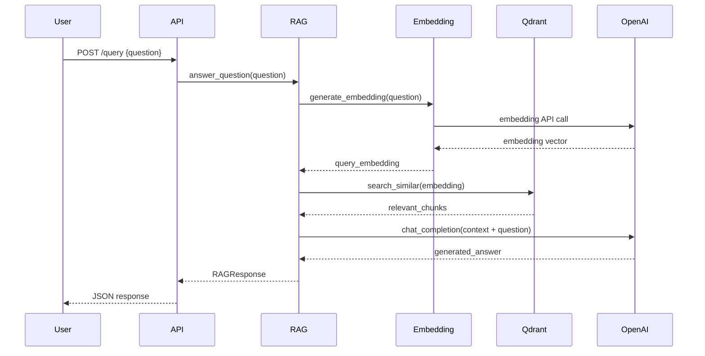

# Design Document

## Overview

The Rust-based RAG web service is designed as a modular, scalable system that processes markdown documents, stores their vector embeddings in Qdrant, and provides intelligent question-answering capabilities. The architecture follows clean architecture principles with clear separation of concerns between web layer, business logic, and data persistence.

## Architecture

The system follows a layered architecture pattern:



### Key Architectural Decisions

1. **Async/Await Pattern**: Leveraging Tokio runtime for handling concurrent requests and I/O operations
2. **Dependency Injection**: Using constructor injection for testability and modularity
3. **Error Handling**: Custom error types with proper error propagation using `Result<T, E>`
4. **Configuration Management**: Environment-based configuration with validation at startup
5. **Structured Logging**: Using `tracing` crate for observability

## Components and Interfaces

### Web Layer Components

#### HTTP Handlers
- `upload_handler`: Processes markdown file uploads
- `query_handler`: Handles question-answering requests
- `health_handler`: Provides service health status

#### Middleware
- Request logging middleware
- Error handling middleware
- CORS middleware for web client integration

### Service Layer Components

#### DocumentService
```rust
pub trait DocumentService {
    async fn process_document(&self, content: String, filename: String) -> Result<DocumentId, ServiceError>;
    async fn get_document_chunks(&self, doc_id: DocumentId) -> Result<Vec<DocumentChunk>, ServiceError>;
}
```

#### EmbeddingService
```rust
pub trait EmbeddingService {
    async fn generate_embedding(&self, text: &str) -> Result<Vec<f32>, ServiceError>;
    async fn generate_embeddings_batch(&self, texts: Vec<&str>) -> Result<Vec<Vec<f32>>, ServiceError>;
}
```

#### VectorSearchService
```rust
pub trait VectorSearchService {
    async fn search_similar(&self, query_embedding: Vec<f32>, limit: usize) -> Result<Vec<SearchResult>, ServiceError>;
    async fn store_embeddings(&self, chunks: Vec<DocumentChunk>) -> Result<(), ServiceError>;
}
```

#### RAGService
```rust
pub trait RAGService {
    async fn answer_question(&self, question: String) -> Result<RAGResponse, ServiceError>;
}
```

### Repository Layer Components

#### QdrantRepository
- Manages vector storage and retrieval operations
- Handles collection management and indexing
- Implements connection pooling and retry logic

### External Service Integrations

#### AzureOpenAIClient
- Handles authentication with Azure OpenAI
- Manages embedding generation requests
- Implements chat completion for answer generation
- Includes rate limiting and retry mechanisms

## Data Models

### Core Domain Models

```rust
#[derive(Debug, Clone, Serialize, Deserialize)]
pub struct DocumentChunk {
    pub id: String,
    pub document_id: String,
    pub content: String,
    pub metadata: ChunkMetadata,
    pub embedding: Option<Vec<f32>>,
}

#[derive(Debug, Clone, Serialize, Deserialize)]
pub struct ChunkMetadata {
    pub source_file: String,
    pub chunk_index: usize,
    pub headers: Vec<String>,
    pub chunk_type: ChunkType,
}

#[derive(Debug, Clone, Serialize, Deserialize)]
pub enum ChunkType {
    Text,
    CodeBlock,
    List,
    Table,
}

#[derive(Debug, Serialize, Deserialize)]
pub struct RAGResponse {
    pub answer: String,
    pub sources: Vec<SourceReference>,
    pub confidence: f32,
}

#[derive(Debug, Serialize, Deserialize)]
pub struct SourceReference {
    pub document_id: String,
    pub chunk_id: String,
    pub relevance_score: f32,
    pub snippet: String,
}
```

### Configuration Models

```rust
#[derive(Debug, Clone)]
pub struct AppConfig {
    pub server: ServerConfig,
    pub azure_openai: AzureOpenAIConfig,
    pub qdrant: QdrantConfig,
}

#[derive(Debug, Clone)]
pub struct AzureOpenAIConfig {
    pub endpoint: String,
    pub api_key: String,
    pub api_version: String,
    pub chat_deployment: String,
    pub embed_deployment: String,
}
```

## Error Handling

### Custom Error Types

```rust
#[derive(Debug, thiserror::Error)]
pub enum ServiceError {
    #[error("Document processing failed: {0}")]
    DocumentProcessing(String),
    
    #[error("Embedding generation failed: {0}")]
    EmbeddingGeneration(String),
    
    #[error("Vector search failed: {0}")]
    VectorSearch(String),
    
    #[error("External API error: {0}")]
    ExternalAPI(String),
    
    #[error("Configuration error: {0}")]
    Configuration(String),
}
```

### Error Propagation Strategy

1. **Service Layer**: Returns `Result<T, ServiceError>` for all operations
2. **Web Layer**: Converts service errors to appropriate HTTP responses
3. **Repository Layer**: Wraps database errors in domain-specific error types
4. **External Services**: Implements retry logic with exponential backoff

## Document Processing Pipeline

### Markdown Parsing Strategy

1. **Content Extraction**: Parse markdown using `pulldown-cmark` crate
2. **Structure Preservation**: Maintain heading hierarchy and content relationships
3. **Chunking Algorithm**: 
   - Split by semantic boundaries (headers, paragraphs)
   - Target chunk size: 500-1000 tokens
   - Overlap: 50-100 tokens between adjacent chunks
4. **Metadata Enrichment**: Extract and store structural information

### Chunking Implementation

```rust
pub struct DocumentChunker {
    max_chunk_size: usize,
    overlap_size: usize,
}

impl DocumentChunker {
    pub fn chunk_document(&self, content: &str) -> Result<Vec<DocumentChunk>, ChunkingError> {
        // Implementation details for semantic chunking
    }
}
```

## Vector Storage Design

### Qdrant Collection Schema

```json
{
  "collection_name": "document_chunks",
  "vector_config": {
    "size": 3072,
    "distance": "Cosine"
  },
  "payload_schema": {
    "document_id": "keyword",
    "source_file": "keyword", 
    "chunk_index": "integer",
    "headers": "keyword",
    "chunk_type": "keyword",
    "content": "text"
  }
}
```

### Search Strategy

1. **Similarity Search**: Use cosine similarity for vector matching
2. **Hybrid Search**: Combine vector similarity with keyword matching
3. **Result Ranking**: Score results based on relevance and recency
4. **Context Window**: Retrieve 3-5 most relevant chunks for RAG context

## RAG Pipeline Design

### Question Processing Flow



### Context Construction

1. **Chunk Selection**: Select top-k relevant chunks based on similarity scores
2. **Context Assembly**: Combine chunks with source attribution
3. **Token Management**: Ensure context fits within model's token limits
4. **Prompt Engineering**: Structure context for optimal answer generation

## Testing Strategy

### Unit Testing
- Service layer components with mocked dependencies
- Document parsing and chunking logic
- Error handling scenarios
- Configuration validation

### Integration Testing
- End-to-end API testing with test database
- Azure OpenAI API integration testing
- Qdrant vector operations testing
- File upload and processing workflows

### Performance Testing
- Load testing for concurrent requests
- Memory usage profiling for large documents
- Vector search performance benchmarking
- API response time monitoring

### Test Data Management
- Sample markdown documents for testing
- Mock responses for external APIs
- Test vector collections in Qdrant
- Automated test data cleanup

## Security Considerations

### API Security
- Input validation and sanitization
- Rate limiting per client
- Request size limits for file uploads
- CORS configuration for web clients

### Data Protection
- Secure storage of API keys in environment variables
- No logging of sensitive data
- Proper error message sanitization
- Vector data encryption at rest (Qdrant configuration)

### Authentication & Authorization
- API key-based authentication for service access
- Role-based access control for administrative endpoints
- Audit logging for sensitive operations

## Performance Optimization

### Caching Strategy
- In-memory caching of frequently accessed embeddings
- Redis integration for distributed caching (future enhancement)
- HTTP response caching for static endpoints

### Batch Processing
- Batch embedding generation for multiple chunks
- Bulk vector insertion to Qdrant
- Asynchronous document processing

### Resource Management
- Connection pooling for external services
- Memory-efficient streaming for large files
- Graceful degradation under high load