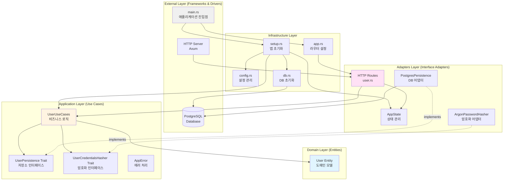
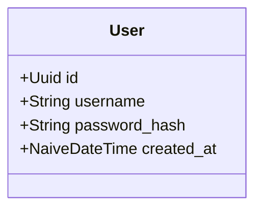
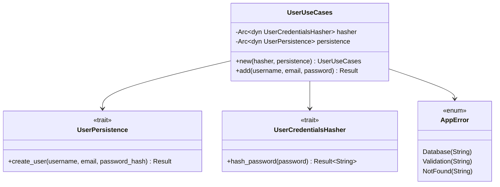
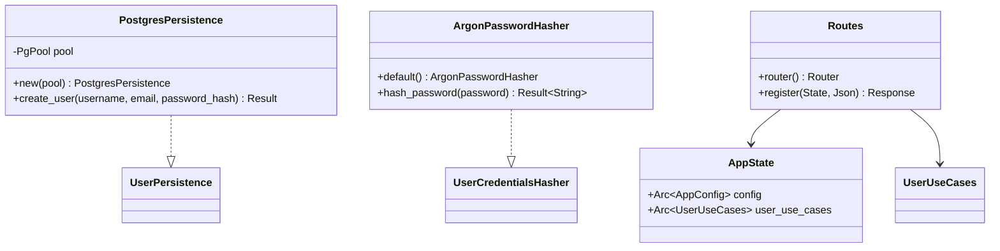
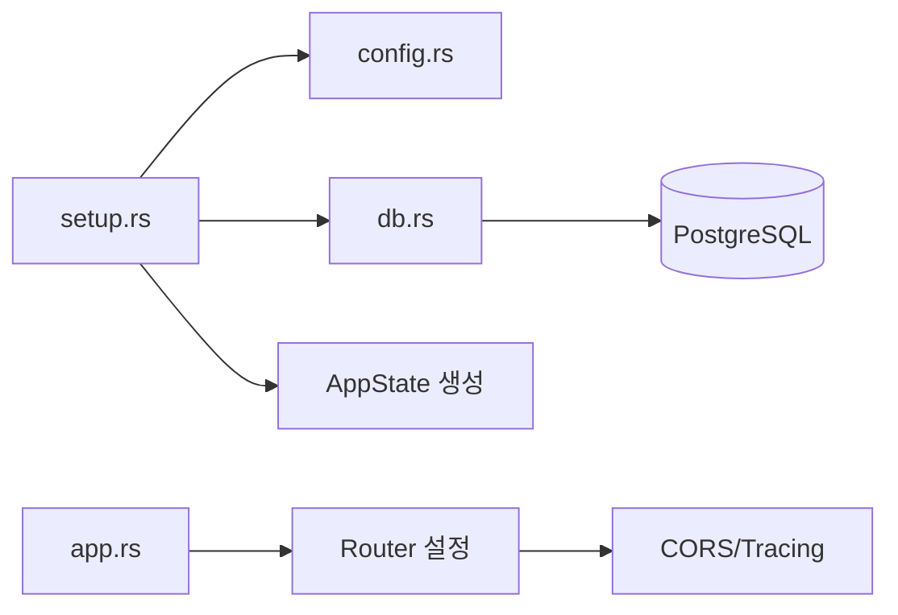
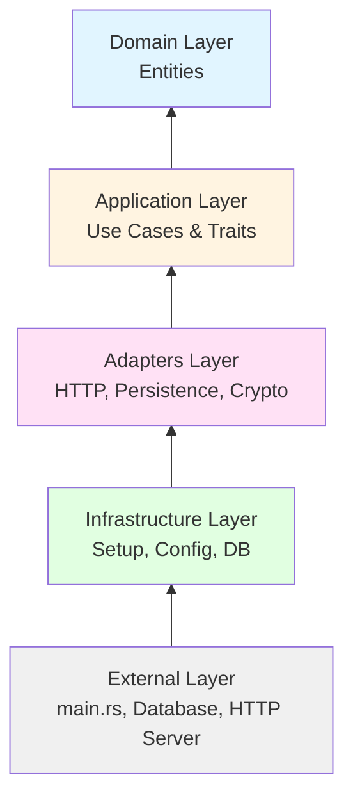
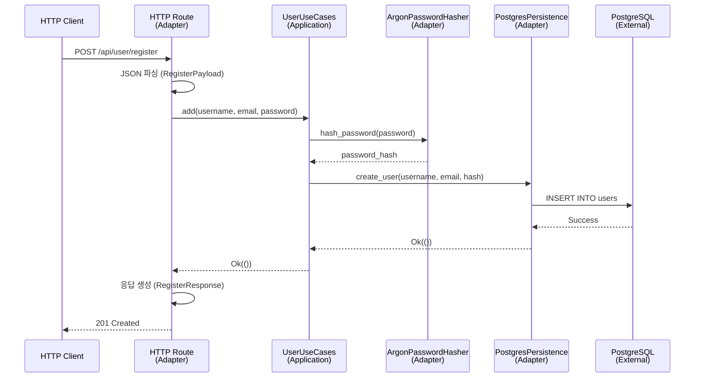
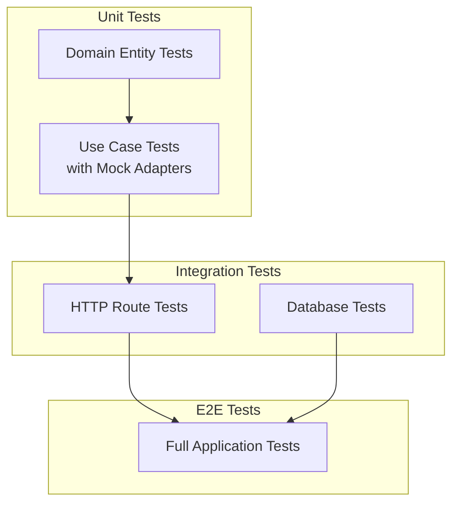

# Clean Architecture - Axum 프로젝트

## 개요

이 프로젝트는 Rust의 Axum 웹 프레임워크를 사용하여 Clean Architecture 원칙을 구현한 예제입니다. Clean Architecture는 비즈니스 로직을 외부 프레임워크, 데이터베이스, UI로부터 독립적으로 유지하여 테스트 가능하고 유지보수가 용이한 코드를 작성하는 것을 목표로 합니다.

## Clean Architecture 계층 구조



## 계층별 상세 설명

### 1. Domain Layer (도메인 계층)

**위치**: `src/domain/`

가장 내부 계층으로, 비즈니스 규칙과 엔티티를 포함합니다. 외부 의존성이 전혀 없습니다.



**주요 컴포넌트**:

- `entities/user.rs`: 사용자 도메인 엔티티

### 2. Application Layer (애플리케이션 계층)

**위치**: `src/application/`

비즈니스 로직과 유스케이스를 포함합니다. 도메인 엔티티를 사용하며, 인터페이스(Trait)를 통해 외부 계층과 통신합니다.



**주요 컴포넌트**:

- `use_cases/user.rs`: 사용자 관련 비즈니스 로직
  - `UserUseCases`: 사용자 등록 등의 유스케이스 구현
  - `UserPersistence`: 저장소 인터페이스 (Trait)
  - `UserCredentialsHasher`: 암호화 인터페이스 (Trait)
- `app_error.rs`: 애플리케이션 에러 정의

### 3. Adapters Layer (어댑터 계층)

**위치**: `src/adapters/`

외부 시스템(HTTP, Database, 암호화 라이브러리)과 애플리케이션 계층을 연결하는 어댑터들을 포함합니다.



**주요 컴포넌트**:

#### HTTP 어댑터 (`adapters/http/`)

- `routes/user.rs`: HTTP 엔드포인트 정의
- `app_state.rs`: 애플리케이션 상태 관리
- `app_error_impl.rs`: HTTP 에러 응답 구현

#### Persistence 어댑터 (`adapters/persistence/`)

- `mod.rs`: PostgreSQL 연결 풀 관리
- `user.rs`: `UserPersistence` Trait 구현

#### Crypto 어댑터 (`adapters/crypto/`)

- `argon2.rs`: `UserCredentialsHasher` Trait 구현

### 4. Infrastructure Layer (인프라 계층)

**위치**: `src/infra/`

프레임워크 설정, 데이터베이스 초기화, 의존성 주입 등을 담당합니다.



**주요 컴포넌트**:

- `setup.rs`: 애플리케이션 초기화 및 의존성 주입
- `config.rs`: 환경 변수 기반 설정 관리
- `db.rs`: 데이터베이스 연결 풀 초기화
- `app.rs`: Axum 라우터 및 미들웨어 설정

## 의존성 흐름



**의존성 규칙**:

1. **내부 계층은 외부 계층을 알지 못함**: Domain과 Application 계층은 Adapters나 Infrastructure를 직접 참조하지 않습니다.
2. **인터페이스를 통한 의존성 역전**: Application 계층은 Trait을 정의하고, Adapters 계층이 이를 구현합니다.
3. **단방향 의존성**: 화살표는 항상 내부(Domain)를 향합니다.

## 데이터 흐름 (사용자 등록 예시)



## 주요 설계 패턴

### 1. Dependency Inversion (의존성 역전)

Application 계층에서 Trait을 정의하고, Adapters 계층에서 구현합니다.

```rust
// Application Layer (Trait 정의)
pub trait UserPersistence: Send + Sync {
    async fn create_user(&self, username: &str, email: &str, password_hash: &str) -> AppResult<()>;
}

// Adapters Layer (Trait 구현)
impl UserPersistence for PostgresPersistence {
    async fn create_user(&self, username: &str, email: &str, password_hash: &str) -> AppResult<()> {
        // PostgreSQL 구현
    }
}
```

### 2. Dependency Injection (의존성 주입)

Infrastructure 계층에서 모든 의존성을 조립합니다.

```rust
pub async fn init_app_state() -> anyhow::Result<AppState> {
    let postgres_arc = Arc::new(postgres_persistence().await?);
    let argon_hasher = argon2_password_hasher();
    
    let user_use_cases = UserUseCases::new(
        Arc::new(argon_hasher),
        postgres_arc.clone()
    );
    
    Ok(AppState {
        config: Arc::new(config),
        user_use_cases: Arc::new(user_use_cases),
    })
}
```

### 3. Repository Pattern

`UserPersistence` Trait은 Repository 패턴을 구현하여 데이터 접근 로직을 추상화합니다.

## 테스트 전략



**테스트 가능성**:

- **Domain Layer**: 순수 함수로 쉽게 테스트 가능
- **Application Layer**: Mock 구현체를 사용하여 격리된 테스트 가능
- **Adapters Layer**: 실제 외부 시스템과의 통합 테스트
- **Infrastructure Layer**: E2E 테스트로 전체 흐름 검증

## 디렉토리 구조

```
src/
├── domain/              # 도메인 계층
│   └── entities/
│       ├── mod.rs
│       └── user.rs      # User 엔티티
│
├── application/         # 애플리케이션 계층
│   ├── use_cases/
│   │   ├── mod.rs
│   │   └── user.rs      # UserUseCases, Traits
│   ├── app_error.rs     # 에러 정의
│   └── mod.rs
│
├── adapters/            # 어댑터 계층
│   ├── http/
│   │   ├── routes/
│   │   │   ├── mod.rs
│   │   │   └── user.rs  # HTTP 엔드포인트
│   │   ├── app_state.rs # 상태 관리
│   │   ├── app_error_impl.rs
│   │   └── mod.rs
│   ├── persistence/
│   │   ├── mod.rs       # PostgresPersistence
│   │   └── user.rs      # UserPersistence 구현
│   ├── crypto/
│   │   ├── mod.rs
│   │   └── argon2.rs    # UserCredentialsHasher 구현
│   └── mod.rs
│
├── infra/               # 인프라 계층
│   ├── app.rs           # 라우터 설정
│   ├── config.rs        # 설정 관리
│   ├── db.rs            # DB 초기화
│   ├── setup.rs         # 의존성 주입
│   └── mod.rs
│
├── lib.rs               # 라이브러리 진입점
└── main.rs              # 애플리케이션 진입점
```

## Clean Architecture의 장점

1. **테스트 용이성**: 각 계층을 독립적으로 테스트 가능
2. **유지보수성**: 비즈니스 로직이 프레임워크로부터 독립적
3. **확장성**: 새로운 어댑터 추가가 용이 (예: REST API → GraphQL)
4. **기술 독립성**: 데이터베이스나 프레임워크 변경이 용이
5. **명확한 책임 분리**: 각 계층의 역할이 명확

## 결론

이 프로젝트는 Rust와 Axum을 사용하여 Clean Architecture를 구현한 실용적인 예제입니다. Trait을 활용한 의존성 역전, Arc를 통한 의존성 주입, 그리고 명확한 계층 분리를 통해 유지보수 가능하고 테스트 가능한 코드베이스를 구축했습니다.
