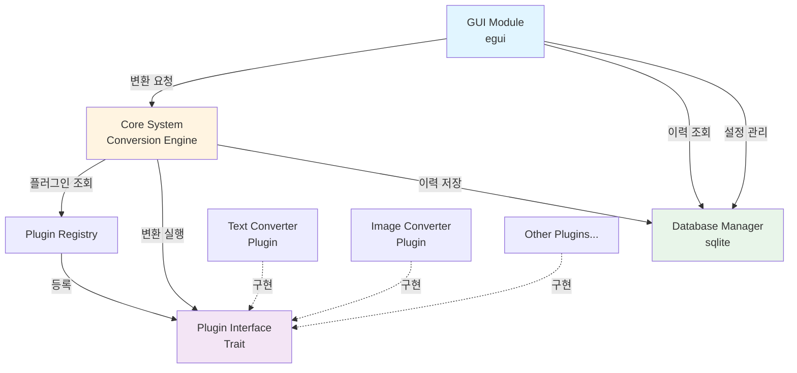

# Design Document

## Overview

파일 확장자 변환 데스크탑 애플리케이션은 Rust의 Cargo workspace를 활용한 모듈형 아키텍처로 설계됩니다. 핵심 시스템은 플러그인 인터페이스를 통해 확장 가능하며, egui 기반 GUI와 sqlite 데이터베이스를 통합합니다.

### Design Goals

- 플러그인을 통한 높은 확장성
- 명확한 책임 분리 (Separation of Concerns)
- 타입 안전성을 활용한 Rust의 강점 극대화
- 크로스 플랫폼 지원
- 최소한의 외부 의존성

## Architecture

### Workspace Structure

```
file-converter-app/
├── Cargo.toml                 # Workspace root
├── core/                      # 핵심 비즈니스 로직
│   ├── Cargo.toml
│   └── src/
│       ├── lib.rs
│       ├── engine.rs          # 변환 엔진
│       └── registry.rs        # 플러그인 레지스트리
├── plugin-interface/          # 플러그인 트레이트 정의
│   ├── Cargo.toml
│   └── src/
│       └── lib.rs
├── database/                  # sqlite 데이터 관리
│   ├── Cargo.toml
│   └── src/
│       ├── lib.rs
│       ├── schema.rs
│       ├── history.rs
│       └── settings.rs
├── gui/                       # egui 기반 UI
│   ├── Cargo.toml
│   └── src/
│       ├── main.rs
│       ├── app.rs
│       ├── widgets/
│       │   ├── mod.rs
│       │   ├── file_selector.rs
│       │   ├── conversion_panel.rs
│       │   └── history_view.rs
│       └── theme.rs
├── plugins/                   # 플러그인 구현체들
│   ├── text-converter/        # 예제: 텍스트 인코딩 변환
│   │   ├── Cargo.toml
│   │   ├── README.md
│   │   └── src/
│   │       └── lib.rs
│   └── image-converter/       # 예제: 이미지 형식 변환 (선택적)
│       ├── Cargo.toml
│       └── src/
│           └── lib.rs
└── README.md
```

### Architecture Diagram



## Components and Interfaces

### 1. Plugin Interface Crate

플러그인이 구현해야 할 표준 인터페이스를 정의합니다.

```rust
// plugin-interface/src/lib.rs

use std::path::Path;
use std::error::Error;

/// 플러그인 메타데이터
#[derive(Debug, Clone)]
pub struct PluginMetadata {
    pub name: String,
    pub version: String,
    pub author: String,
    pub description: String,
}

/// 지원하는 파일 형식
#[derive(Debug, Clone, PartialEq, Eq, Hash)]
pub struct FileFormat {
    pub extension: String,
    pub mime_type: String,
    pub description: String,
}

/// 변환 결과
#[derive(Debug)]
pub struct ConversionResult {
    pub success: bool,
    pub output_path: Option<String>,
    pub message: String,
    pub bytes_processed: usize,
}

/// 변환 옵션
#[derive(Debug, Clone)]
pub struct ConversionOptions {
    pub output_path: Option<String>,
    pub overwrite: bool,
    pub quality: Option<u8>,
    pub custom_params: std::collections::HashMap<String, String>,
}

/// 플러그인 트레이트
pub trait Plugin: Send + Sync {
    /// 플러그인 메타데이터 반환
    fn metadata(&self) -> PluginMetadata;
    
    /// 지원하는 입력 형식 목록
    fn supported_input_formats(&self) -> Vec<FileFormat>;
    
    /// 지원하는 출력 형식 목록
    fn supported_output_formats(&self) -> Vec<FileFormat>;
    
    /// 특정 변환이 가능한지 확인
    fn can_convert(&self, from: &FileFormat, to: &FileFormat) -> bool;
    
    /// 파일 변환 실행
    fn convert(
        &self,
        input_path: &Path,
        output_format: &FileFormat,
        options: &ConversionOptions,
    ) -> Result<ConversionResult, Box<dyn Error>>;
    
    /// 플러그인 초기화 (선택적)
    fn initialize(&mut self) -> Result<(), Box<dyn Error>> {
        Ok(())
    }
    
    /// 플러그인 정리 (선택적)
    fn cleanup(&mut self) -> Result<(), Box<dyn Error>> {
        Ok(())
    }
}

/// 플러그인 생성자 타입
pub type PluginConstructor = fn() -> Box<dyn Plugin>;
```

### 2. Core System

변환 엔진과 플러그인 레지스트리를 포함합니다.

```rust
// core/src/registry.rs

use plugin_interface::{Plugin, FileFormat, PluginMetadata};
use std::collections::HashMap;
use std::sync::{Arc, RwLock};

pub struct PluginRegistry {
    plugins: Arc<RwLock<HashMap<String, Box<dyn Plugin>>>>,
}

impl PluginRegistry {
    pub fn new() -> Self {
        Self {
            plugins: Arc::new(RwLock::new(HashMap::new())),
        }
    }
    
    pub fn register_plugin(&self, plugin: Box<dyn Plugin>) -> Result<(), String> {
        let metadata = plugin.metadata();
        let mut plugins = self.plugins.write().unwrap();
        
        if plugins.contains_key(&metadata.name) {
            return Err(format!("Plugin '{}' already registered", metadata.name));
        }
        
        plugins.insert(metadata.name.clone(), plugin);
        Ok(())
    }
    
    pub fn get_plugin(&self, name: &str) -> Option<Box<dyn Plugin>> {
        // 실제 구현에서는 Arc<dyn Plugin> 사용 권장
        None // Simplified
    }
    
    pub fn list_plugins(&self) -> Vec<PluginMetadata> {
        let plugins = self.plugins.read().unwrap();
        plugins.values().map(|p| p.metadata()).collect()
    }
    
    pub fn find_plugins_for_conversion(
        &self,
        from: &FileFormat,
        to: &FileFormat,
    ) -> Vec<String> {
        let plugins = self.plugins.read().unwrap();
        plugins
            .iter()
            .filter(|(_, p)| p.can_convert(from, to))
            .map(|(name, _)| name.clone())
            .collect()
    }
}
```

```rust
// core/src/engine.rs

use plugin_interface::{Plugin, FileFormat, ConversionOptions, ConversionResult};
use std::path::Path;
use std::error::Error;

pub struct ConversionEngine {
    registry: Arc<PluginRegistry>,
}

impl ConversionEngine {
    pub fn new(registry: Arc<PluginRegistry>) -> Self {
        Self { registry }
    }
    
    pub fn convert_file(
        &self,
        input_path: &Path,
        output_format: &FileFormat,
        plugin_name: &str,
        options: &ConversionOptions,
    ) -> Result<ConversionResult, Box<dyn Error>> {
        // 1. 플러그인 조회
        // 2. 입력 파일 검증
        // 3. 변환 실행
        // 4. 결과 반환
        todo!()
    }
    
    pub fn batch_convert(
        &self,
        files: Vec<&Path>,
        output_format: &FileFormat,
        plugin_name: &str,
        options: &ConversionOptions,
    ) -> Vec<Result<ConversionResult, Box<dyn Error>>> {
        files
            .iter()
            .map(|path| self.convert_file(path, output_format, plugin_name, options))
            .collect()
    }
}
```

### 3. Database Manager

sqlite를 사용한 데이터 영속성 관리.

```rust
// database/src/schema.rs

use rusqlite::{Connection, Result};

pub fn initialize_database(conn: &Connection) -> Result<()> {
    // 변환 이력 테이블
    conn.execute(
        "CREATE TABLE IF NOT EXISTS conversion_history (
            id INTEGER PRIMARY KEY AUTOINCREMENT,
            timestamp TEXT NOT NULL,
            input_file TEXT NOT NULL,
            output_file TEXT,
            input_format TEXT NOT NULL,
            output_format TEXT NOT NULL,
            plugin_name TEXT NOT NULL,
            status TEXT NOT NULL,
            error_message TEXT,
            bytes_processed INTEGER,
            duration_ms INTEGER
        )",
        [],
    )?;
    
    // 사용자 설정 테이블
    conn.execute(
        "CREATE TABLE IF NOT EXISTS settings (
            key TEXT PRIMARY KEY,
            value TEXT NOT NULL,
            updated_at TEXT NOT NULL
        )",
        [],
    )?;
    
    // 인덱스 생성
    conn.execute(
        "CREATE INDEX IF NOT EXISTS idx_history_timestamp 
         ON conversion_history(timestamp DESC)",
        [],
    )?;
    
    Ok(())
}
```

```rust
// database/src/history.rs

use rusqlite::{Connection, Result, params};
use chrono::{DateTime, Utc};

#[derive(Debug, Clone)]
pub struct ConversionHistoryEntry {
    pub id: i64,
    pub timestamp: DateTime<Utc>,
    pub input_file: String,
    pub output_file: Option<String>,
    pub input_format: String,
    pub output_format: String,
    pub plugin_name: String,
    pub status: String,
    pub error_message: Option<String>,
    pub bytes_processed: usize,
    pub duration_ms: u64,
}

pub struct HistoryManager {
    conn: Connection,
}

impl HistoryManager {
    pub fn new(db_path: &str) -> Result<Self> {
        let conn = Connection::open(db_path)?;
        crate::schema::initialize_database(&conn)?;
        Ok(Self { conn })
    }
    
    pub fn add_entry(&self, entry: &ConversionHistoryEntry) -> Result<i64> {
        self.conn.execute(
            "INSERT INTO conversion_history 
             (timestamp, input_file, output_file, input_format, output_format, 
              plugin_name, status, error_message, bytes_processed, duration_ms)
             VALUES (?1, ?2, ?3, ?4, ?5, ?6, ?7, ?8, ?9, ?10)",
            params![
                entry.timestamp.to_rfc3339(),
                entry.input_file,
                entry.output_file,
                entry.input_format,
                entry.output_format,
                entry.plugin_name,
                entry.status,
                entry.error_message,
                entry.bytes_processed as i64,
                entry.duration_ms as i64,
            ],
        )?;
        Ok(self.conn.last_insert_rowid())
    }
    
    pub fn get_recent_entries(&self, limit: usize) -> Result<Vec<ConversionHistoryEntry>> {
        // 최근 이력 조회 구현
        todo!()
    }
}
```

### 4. GUI Module

egui를 사용한 사용자 인터페이스.

```rust
// gui/src/app.rs

use eframe::egui;
use std::sync::Arc;

pub struct FileConverterApp {
    core_engine: Arc<ConversionEngine>,
    db_manager: Arc<HistoryManager>,
    
    // UI 상태
    selected_files: Vec<String>,
    selected_output_format: Option<FileFormat>,
    available_plugins: Vec<PluginMetadata>,
    selected_plugin: Option<String>,
    conversion_progress: f32,
    is_converting: bool,
    
    // 탭 상태
    active_tab: AppTab,
    history_entries: Vec<ConversionHistoryEntry>,
}

#[derive(PartialEq)]
enum AppTab {
    Converter,
    History,
    Settings,
}

impl eframe::App for FileConverterApp {
    fn update(&mut self, ctx: &egui::Context, _frame: &mut eframe::Frame) {
        egui::CentralPanel::default().show(ctx, |ui| {
            // 상단 탭 메뉴
            ui.horizontal(|ui| {
                ui.selectable_value(&mut self.active_tab, AppTab::Converter, "변환");
                ui.selectable_value(&mut self.active_tab, AppTab::History, "이력");
                ui.selectable_value(&mut self.active_tab, AppTab::Settings, "설정");
            });
            
            ui.separator();
            
            // 탭별 컨텐츠
            match self.active_tab {
                AppTab::Converter => self.show_converter_tab(ui),
                AppTab::History => self.show_history_tab(ui),
                AppTab::Settings => self.show_settings_tab(ui),
            }
        });
    }
}

impl FileConverterApp {
    fn show_converter_tab(&mut self, ui: &mut egui::Ui) {
        // 파일 선택 영역
        ui.heading("파일 선택");
        if ui.button("파일 선택...").clicked() {
            // 파일 다이얼로그 열기
        }
        
        // 선택된 파일 목록
        for file in &self.selected_files {
            ui.label(file);
        }
        
        ui.separator();
        
        // 출력 형식 선택
        ui.heading("출력 형식");
        egui::ComboBox::from_label("형식 선택")
            .selected_text(
                self.selected_output_format
                    .as_ref()
                    .map(|f| f.extension.as_str())
                    .unwrap_or("선택하세요")
            )
            .show_ui(ui, |ui| {
                // 사용 가능한 형식 목록
            });
        
        ui.separator();
        
        // 변환 버튼
        if ui.button("변환 시작").clicked() && !self.is_converting {
            self.start_conversion();
        }
        
        // 진행률 표시
        if self.is_converting {
            ui.add(egui::ProgressBar::new(self.conversion_progress));
        }
    }
    
    fn show_history_tab(&mut self, ui: &mut egui::Ui) {
        ui.heading("변환 이력");
        
        egui::ScrollArea::vertical().show(ui, |ui| {
            for entry in &self.history_entries {
                ui.group(|ui| {
                    ui.label(format!("입력: {}", entry.input_file));
                    ui.label(format!("출력: {}", entry.output_file.as_deref().unwrap_or("N/A")));
                    ui.label(format!("상태: {}", entry.status));
                    ui.label(format!("시간: {}", entry.timestamp));
                });
            }
        });
    }
    
    fn show_settings_tab(&mut self, ui: &mut egui::Ui) {
        ui.heading("설정");
        // 설정 UI 구현
    }
    
    fn start_conversion(&mut self) {
        // 비동기 변환 시작
        self.is_converting = true;
    }
}
```

### 5. Example Plugin: Text Converter

```rust
// plugins/text-converter/src/lib.rs

use plugin_interface::*;
use std::path::Path;
use std::error::Error;
use std::fs;
use encoding_rs::*;

pub struct TextConverterPlugin;

impl Plugin for TextConverterPlugin {
    fn metadata(&self) -> PluginMetadata {
        PluginMetadata {
            name: "Text Converter".to_string(),
            version: "0.1.0".to_string(),
            author: "File Converter Team".to_string(),
            description: "텍스트 파일 인코딩 변환".to_string(),
        }
    }
    
    fn supported_input_formats(&self) -> Vec<FileFormat> {
        vec![
            FileFormat {
                extension: "txt".to_string(),
                mime_type: "text/plain".to_string(),
                description: "Plain Text".to_string(),
            },
        ]
    }
    
    fn supported_output_formats(&self) -> Vec<FileFormat> {
        self.supported_input_formats()
    }
    
    fn can_convert(&self, from: &FileFormat, to: &FileFormat) -> bool {
        from.extension == "txt" && to.extension == "txt"
    }
    
    fn convert(
        &self,
        input_path: &Path,
        output_format: &FileFormat,
        options: &ConversionOptions,
    ) -> Result<ConversionResult, Box<dyn Error>> {
        // 1. 파일 읽기
        let input_bytes = fs::read(input_path)?;
        
        // 2. 인코딩 감지 및 디코딩
        let (decoded, _, _) = UTF_8.decode(&input_bytes);
        
        // 3. 대상 인코딩으로 변환
        let target_encoding = options.custom_params
            .get("encoding")
            .and_then(|e| Encoding::for_label(e.as_bytes()))
            .unwrap_or(UTF_8);
        
        let (encoded, _, _) = target_encoding.encode(&decoded);
        
        // 4. 출력 파일 저장
        let output_path = options.output_path
            .as_ref()
            .map(|p| p.to_string())
            .unwrap_or_else(|| {
                format!("{}_converted.txt", input_path.file_stem().unwrap().to_str().unwrap())
            });
        
        fs::write(&output_path, &encoded)?;
        
        Ok(ConversionResult {
            success: true,
            output_path: Some(output_path),
            message: "변환 완료".to_string(),
            bytes_processed: encoded.len(),
        })
    }
}

// 플러그인 생성자
#[no_mangle]
pub fn create_plugin() -> Box<dyn Plugin> {
    Box::new(TextConverterPlugin)
}
```

## Data Models

### Core Data Structures

```rust
// 변환 작업
pub struct ConversionTask {
    pub id: Uuid,
    pub input_files: Vec<PathBuf>,
    pub output_format: FileFormat,
    pub plugin_name: String,
    pub options: ConversionOptions,
    pub status: TaskStatus,
    pub created_at: DateTime<Utc>,
    pub started_at: Option<DateTime<Utc>>,
    pub completed_at: Option<DateTime<Utc>>,
}

pub enum TaskStatus {
    Pending,
    Running,
    Completed,
    Failed(String),
    Cancelled,
}

// 애플리케이션 설정
pub struct AppSettings {
    pub default_output_dir: Option<PathBuf>,
    pub theme: Theme,
    pub language: String,
    pub auto_save_history: bool,
    pub max_history_entries: usize,
}

pub enum Theme {
    Light,
    Dark,
    System,
}
```

## Error Handling

### Error Types

```rust
// core/src/error.rs

use thiserror::Error;

#[derive(Error, Debug)]
pub enum ConversionError {
    #[error("플러그인을 찾을 수 없습니다: {0}")]
    PluginNotFound(String),
    
    #[error("지원하지 않는 파일 형식: {0}")]
    UnsupportedFormat(String),
    
    #[error("파일 읽기 실패: {0}")]
    FileReadError(#[from] std::io::Error),
    
    #[error("변환 실패: {0}")]
    ConversionFailed(String),
    
    #[error("데이터베이스 오류: {0}")]
    DatabaseError(#[from] rusqlite::Error),
    
    #[error("플러그인 초기화 실패: {0}")]
    PluginInitError(String),
}

pub type ConversionResult<T> = Result<T, ConversionError>;
```

### Error Recovery Strategy

1. **파일 오류**: 원본 파일 보존, 부분 출력 파일 삭제
2. **플러그인 오류**: 오류 로깅, 사용자에게 알림, 대체 플러그인 제안
3. **데이터베이스 오류**: 메모리 내 임시 저장, 재시도 메커니즘
4. **일괄 변환 오류**: 실패한 파일 건너뛰기, 나머지 계속 처리

## Testing Strategy

### Unit Tests

- 각 크레이트별 단위 테스트
- 플러그인 인터페이스 구현 검증
- 데이터베이스 CRUD 작업 테스트
- 변환 엔진 로직 테스트

### Integration Tests

- 플러그인 로딩 및 실행 통합 테스트
- GUI와 Core 시스템 통합
- 데이터베이스 영속성 테스트
- 일괄 변환 시나리오 테스트

### Test Structure

```rust
// core/tests/integration_test.rs

#[cfg(test)]
mod tests {
    use super::*;
    
    #[test]
    fn test_plugin_registration() {
        let registry = PluginRegistry::new();
        let plugin = Box::new(MockPlugin::new());
        
        assert!(registry.register_plugin(plugin).is_ok());
    }
    
    #[test]
    fn test_file_conversion() {
        // 테스트 파일 생성
        // 변환 실행
        // 결과 검증
    }
}
```

## Dependencies

### Workspace Cargo.toml

```toml
[workspace]
members = [
    "core",
    "plugin-interface",
    "database",
    "gui",
    "plugins/text-converter",
]

[workspace.dependencies]
# 공통 의존성
anyhow = "1.0"
thiserror = "1.0"
serde = { version = "1.0", features = ["derive"] }
serde_json = "1.0"
chrono = { version = "0.4", features = ["serde"] }
uuid = { version = "1.0", features = ["v4", "serde"] }

# GUI
eframe = "0.28"
egui = "0.28"
rfd = "0.14"  # 파일 다이얼로그

# Database
rusqlite = { version = "0.31", features = ["bundled"] }

# 플러그인 관련
libloading = "0.8"

# 유틸리티
log = "0.4"
env_logger = "0.11"
```

## Performance Considerations

1. **비동기 처리**: 대용량 파일 변환 시 UI 블로킹 방지
2. **스레드 풀**: 일괄 변환 시 병렬 처리
3. **메모리 관리**: 스트리밍 방식으로 대용량 파일 처리
4. **데이터베이스 최적화**: 인덱스 활용, 배치 삽입

## Security Considerations

1. **파일 경로 검증**: 경로 탐색 공격 방지
2. **플러그인 샌드박싱**: 플러그인 권한 제한 (향후 개선)
3. **입력 검증**: 파일 크기 제한, 형식 검증
4. **오류 메시지**: 민감한 정보 노출 방지
