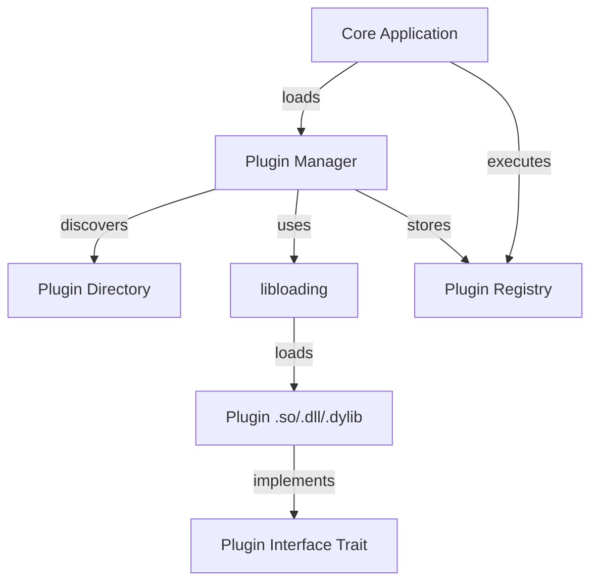

# Design Document

## Overview

This design implements a dynamic plugin system for Rust using a Cargo workspace architecture. The system consists of three main components: a plugin interface crate defining the contract, a core application that manages plugin lifecycle, and example plugin implementations. The design uses dynamic library loading (libloading) to achieve runtime extensibility while maintaining type safety through trait-based interfaces.

## Architecture

### Workspace Structure

```
rust-plugin-system/
├── Cargo.toml                 # Workspace root
├── plugin-interface/          # Shared interface crate
│   ├── Cargo.toml
│   └── src/
│       └── lib.rs
├── core-app/                  # Main application
│   ├── Cargo.toml
│   └── src/
│       └── main.rs
├── plugins/                   # Plugin implementations
│   ├── hello-plugin/
│   │   ├── Cargo.toml
│   │   └── src/
│   │       └── lib.rs
│   └── math-plugin/
│       ├── Cargo.toml
│       └── src/
│           └── lib.rs
└── target/
    └── debug/
        └── plugins/           # Runtime plugin directory
```

### Component Interaction



## Components and Interfaces

### 1. Plugin Interface Crate

**Purpose**: Define the contract that all plugins must implement

**Key Types**:

```rust
pub trait Plugin: Send + Sync {
    fn name(&self) -> &str;
    fn version(&self) -> &str;
    fn description(&self) -> &str;
    fn on_load(&mut self) -> Result<(), Box<dyn std::error::Error>>;
    fn execute(&self, context: &PluginContext) -> Result<String, Box<dyn std::error::Error>>;
    fn on_unload(&mut self) -> Result<(), Box<dyn std::error::Error>>;
}

pub struct PluginContext {
    pub data: HashMap<String, String>,
}

pub type PluginCreate = unsafe fn() -> *mut dyn Plugin;
```

**Design Decisions**:
- Use trait objects for dynamic dispatch
- Require Send + Sync for thread safety
- Use Result types for error handling
- Export constructor function with C ABI for cross-language compatibility
- PluginContext allows passing runtime data to plugins

### 2. Core Application

**Purpose**: Host application that manages plugin lifecycle

**Key Components**:

**PluginManager**:
```rust
pub struct PluginManager {
    plugins: Vec<Box<dyn Plugin>>,
    libraries: Vec<Library>,  // Keep libraries alive
}

impl PluginManager {
    pub fn new() -> Self;
    pub fn discover_plugins(&mut self, plugin_dir: &Path) -> Result<()>;
    pub fn load_plugin(&mut self, path: &Path) -> Result<()>;
    pub fn execute_all(&self, context: &PluginContext) -> Vec<Result<String>>;
    pub fn shutdown(&mut self) -> Result<()>;
}
```

**Main Application Flow**:
1. Initialize PluginManager
2. Discover plugins in designated directory
3. Load each plugin dynamically
4. Execute plugins with context
5. Cleanup on shutdown

**Design Decisions**:
- Store both plugin instances and library handles to prevent premature unloading
- Use Vec for simple sequential plugin execution
- Graceful error handling - one plugin failure doesn't crash the system
- Plugins directory configurable via command-line or environment variable

### 3. Plugin Implementations

**Purpose**: Demonstrate plugin system with concrete examples

**Hello Plugin**:
- Simple greeting functionality
- Demonstrates basic plugin structure
- Uses context data for personalization

**Math Plugin**:
- Performs calculations
- Demonstrates stateful plugin behavior
- Shows error handling in plugin execution

**Plugin Structure Pattern**:
```rust
pub struct MyPlugin {
    // Plugin state
}

impl Plugin for MyPlugin {
    // Trait implementation
}

#[no_mangle]
pub extern "C" fn _plugin_create() -> *mut dyn Plugin {
    Box::into_raw(Box::new(MyPlugin::new()))
}
```

**Design Decisions**:
- Use `#[no_mangle]` to preserve symbol names
- Use `extern "C"` for stable ABI
- Compile as `cdylib` for dynamic loading
- Each plugin is self-contained with minimal dependencies

## Data Models

### Plugin Metadata

```rust
struct PluginMetadata {
    name: String,
    version: String,
    description: String,
}
```

### Plugin Context

```rust
pub struct PluginContext {
    pub data: HashMap<String, String>,
}
```

Allows passing arbitrary key-value data to plugins at execution time.

## Error Handling

### Error Types

- **Plugin Loading Errors**: Library not found, symbol resolution failure, incompatible ABI
- **Plugin Execution Errors**: Runtime errors within plugin logic
- **Plugin Lifecycle Errors**: Initialization or cleanup failures

### Error Handling Strategy

1. **Loading Phase**: Log errors and continue loading other plugins
2. **Execution Phase**: Collect results including errors, don't crash on single plugin failure
3. **Shutdown Phase**: Attempt cleanup for all plugins, log failures

```rust
// Example error handling pattern
match plugin_manager.load_plugin(&plugin_path) {
    Ok(_) => println!("Loaded plugin: {:?}", plugin_path),
    Err(e) => eprintln!("Failed to load plugin {:?}: {}", plugin_path, e),
}
```

## Testing Strategy

### Unit Tests

- **Plugin Interface**: Test trait method signatures and types
- **Plugin Manager**: Test plugin discovery, loading logic with mock plugins
- **Individual Plugins**: Test plugin logic in isolation

### Integration Tests

- **End-to-End Loading**: Test loading real compiled plugins
- **Execution Flow**: Test complete lifecycle from discovery to execution to cleanup
- **Error Scenarios**: Test behavior with missing plugins, corrupted libraries, failing plugins

### Test Organization

```
core-app/
├── src/
│   └── main.rs
└── tests/
    └── integration_tests.rs

plugins/hello-plugin/
└── src/
    └── lib.rs  # Contains #[cfg(test)] unit tests
```

## Build and Deployment

### Build Process

1. Build plugin-interface crate first (dependency for all)
2. Build plugin implementations as cdylib
3. Build core application
4. Copy plugin .so/.dll/.dylib files to runtime plugins directory

### Cargo Workspace Configuration

```toml
[workspace]
members = [
    "plugin-interface",
    "core-app",
    "plugins/hello-plugin",
    "plugins/math-plugin",
]
```

### Runtime Directory Structure

```
target/debug/
├── core-app              # Main executable
└── plugins/              # Plugin libraries
    ├── libhello_plugin.so
    └── libmath_plugin.so
```

## Security Considerations

- Plugins run with same privileges as core application
- No sandboxing in this basic implementation
- Plugin code should be from trusted sources
- Future enhancement: implement plugin signature verification

## Performance Considerations

- Dynamic loading has minimal overhead (one-time cost at startup)
- Plugin execution performance depends on implementation
- No significant overhead from trait-based dispatch
- Plugins loaded sequentially; parallel loading possible as enhancement

## Future Enhancements

1. Plugin dependency management
2. Hot-reloading of plugins
3. Plugin configuration files
4. Inter-plugin communication
5. Plugin sandboxing/isolation
6. Async plugin execution
7. Plugin versioning and compatibility checking
